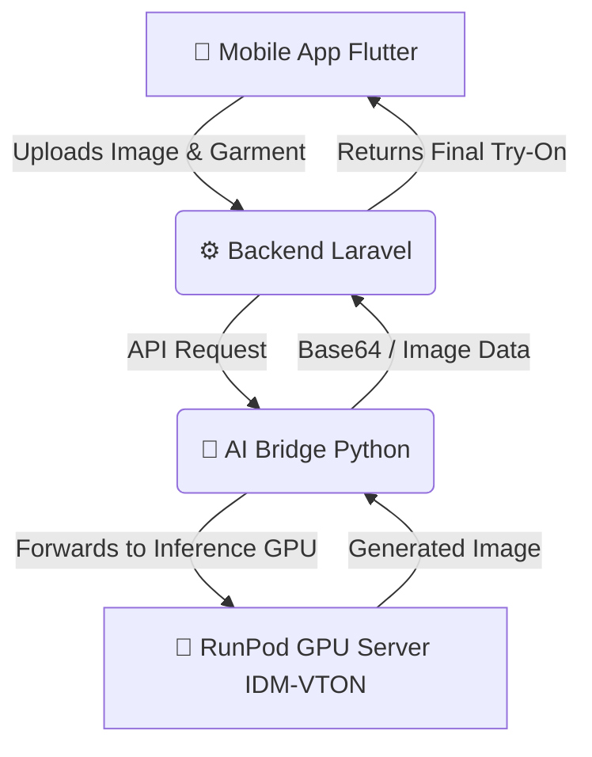

# 👗 AI Virtual Try-On Studio (Virtual Dress Room)

Welcome to the **Virtual Dress Room** repository! This is an advanced AI-powered Virtual Try-On application that allows users to virtually try on clothing using cutting-edge Generative AI models.

This repository is a **Monorepo** containing the complete 3-Tier Architecture of the project.

---

## 🏗️ Architecture & Data Flow

The project is structured into three main layers, ensuring high performance, separation of concerns, and scalable AI inference.



### 1️⃣ Mobile Frontend (Flutter)
- **Folder:** `/Mobile-App-Flutter`
- **Tech Stack:** Flutter, Dart
- **Role:** The user interface for the application. Users can take their photo, select a garment, and initiate the virtual try-on process.

### 2️⃣ Backend API (Laravel)
- **Folder:** `/Backend-Laravel`
- **Tech Stack:** Laravel (PHP), MySQL
- **Role:** Handles user authentication, stores images, and manages business logic. It receives requests from the mobile app and acts as the secure gateway to the AI Bridge.

### 3️⃣ AI Bridge (Python / Hugging Face Spaces)
- **Folder:** `/AI-Bridge-Python`
- **Tech Stack:** Python, FastAPI, Hugging Face Spaces
- **Role:** Hosted on Hugging Face, this middleware connects the Laravel backend to the heavy GPU server. It prevents timeout issues, handles rate limiting, and securely routes requests to RunPod.

### 4️⃣ AI Engine (RunPod GPU Server)
- **Folder:** `/RunPod-GPU-Server`
- **Tech Stack:** RunPod, RTX 3090, PyTorch, IDM-VTON, Diffusers
- **Role:** The core AI engine. It loads the massive 15GB IDM-VTON model into GPU VRAM to perform high-quality virtual try-on inference in under 30 seconds.

---

## 🛠️ Technology Stack
- **Frontend:** Flutter, Dart
- **Backend Core:** Laravel, PHP, MySQL
- **Middleware:** Hugging Face Spaces, Python, Gradio Client / Requests
- **Cloud Infrastructure:** RunPod (Cloud GPU)
- **AI Models:** IDM-VTON, PyTorch, Diffusers, Detectron2, OpenPose

---

## 🚀 How to Run Locally

### Flutter App
```bash
cd Mobile-App-Flutter
flutter pub get
flutter run
```

### Laravel Backend
```bash
cd Backend-Laravel
composer install
cp .env.example .env
php artisan key:generate
php artisan serve
```

### AI Bridge
```bash
cd AI-Bridge-Python
pip install -r requirements.txt
python app.py
```

---
*Developed by Ghazala Sarfraz*
