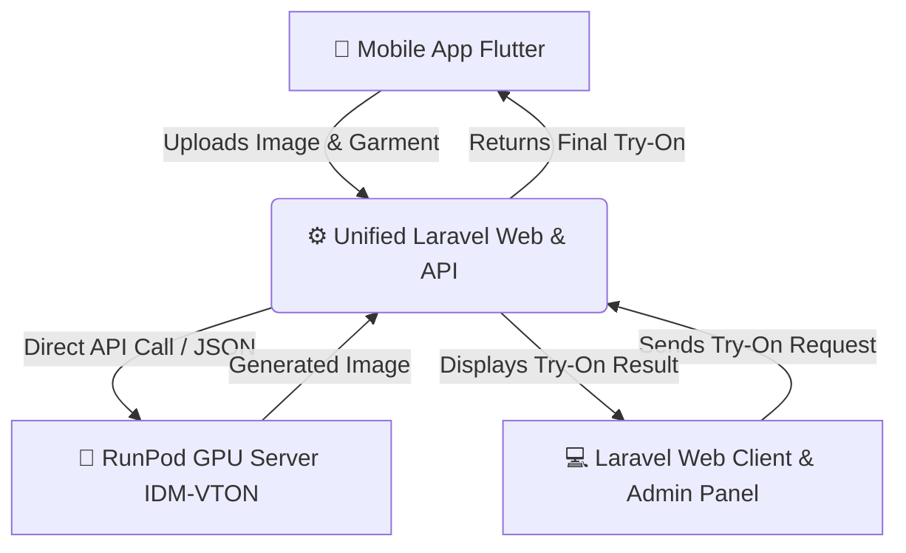

# 👗 AI Virtual Try-On Studio (Virtual Dress Room)

Welcome to the **Virtual Dress Room** repository! This is an advanced AI-powered Virtual Try-On application that allows users to virtually try on clothing using cutting-edge Generative AI models.

## 🌐 Live Website

🚀 **Live Demo:** https://bgnuf22eight.com/virtual_dress_room/

Experience the AI-powered Virtual Dress Room directly through the live web application.
This repository is a **Monorepo** containing the complete 3-Tier Architecture of the project, serving both Mobile and Web platforms.

---

## 🏗️ Architecture & Data Flow

The project is structured into distinct layers to ensure high performance, separation of concerns, and scalable AI inference. Both the Flutter Mobile Client and the Laravel Web & Admin Portal communicate directly with the Laravel backend, which forwards try-on requests to the RunPod GPU endpoint.



### 1️⃣ Mobile Frontend (Flutter)
- **Folder:** `/Mobile-App-Flutter`
- **Tech Stack:** Flutter, Dart
- **Role:** The mobile user interface. Users can take their photo, select a garment, and initiate the virtual try-on process.

### 2️⃣ Unified Laravel Web Platform & Backend API (Laravel)
- **Folder:** `/Backend-Laravel`
- **Tech Stack:** Laravel (PHP), MySQL, Custom Luxury CSS Theme, JavaScript
- **Role:** Handles user authentication, stores images, manages business logic, and hosts both the **Web Client** and **Admin Dashboard**.
  - **Web Client:** Browse catalog, manage wishlists/carts, make purchases, view order history, and submit 5-star rating reviews.
  - **Admin Dashboard:** Manage products, moderate reviews, and update customer order status in real time.
  - **API Backend:** Acts as the secure gateway connecting the Flutter app to the database and making direct inference calls to the RunPod GPU server.

### 3️⃣ AI Engine & API (RunPod GPU Server)
- **Folder:** `/RunPod-GPU-Server`
- **Tech Stack:** RunPod, RTX 3090, PyTorch, VirtualFit AI, Python (FastAPI / Serverless Worker)
- **Role:** The core AI engine. It loads the massive 15GB VirtualFit AI model into GPU VRAM to perform high-quality virtual try-on inference in under 30 seconds. It exposes a direct endpoint that the Laravel backend queries asynchronously to process images.

---

## ✨ Features (Web & Mobile)

### 🛒 E-Commerce & Checkout
- **Smart Add to Cart:** Handles guest checkout redirection, seamlessly carrying wishlist items to the user dashboard post-login.
- **Selective Payments & Single Checkout:** Supports checking out individual items from the cart or selecting specific products rather than forcing a full cart purchase.
- **Dynamic Star Rating System:** Allows users to leave star ratings for delivered products directly from their dashboard:
  - `5 Stars` = Excellent
  - `4 Stars` = Good
  - `3 Stars` = Average
  - `2 Stars` = Poor
  - `1 Star` = Terrible
- **Admin Control Center:**
  - Real-time Order Status updater (**Processing 🟡** ➜ **Shipped 🔵** ➜ **Delivered 🟢** ➜ **Cancelled 🔴**).
  - Review monitoring and deletion dashboard.
  - User and inventory statistics.
- **Security & UX Enhancements:** 
  - Dynamic password visibility toggles (Eye icon 👁️) on Reset Password pages.
  - Custom cache-flashing utility routes for easy deployment maintenance.

---

## 🛠️ Technology Stack
- **Frontend:** Flutter, Dart (Mobile) | Blade, JS, Custom Vanilla CSS (Web)
- **Backend Core:** Laravel, PHP, MySQL
- **Cloud Infrastructure:** RunPod (Cloud GPU)
- **AI Models:** VirtualFit AI, PyTorch, Diffusers, Detectron2, OpenPose

---

## 🚀 How to Run Locally

### Flutter App
```bash
cd Mobile-App-Flutter
flutter pub get
flutter run
```

### Laravel Backend & Web Portal
```bash
cd Backend-Laravel
composer install
cp .env.example .env
php artisan key:generate
php artisan migrate --seed
php artisan storage:link
php artisan serve
```

### RunPod GPU Server API
```bash
cd RunPod-GPU-Server
pip install -r requirements.txt
python app.py
```

---
*Developed by Ghazala Sarfraz*
